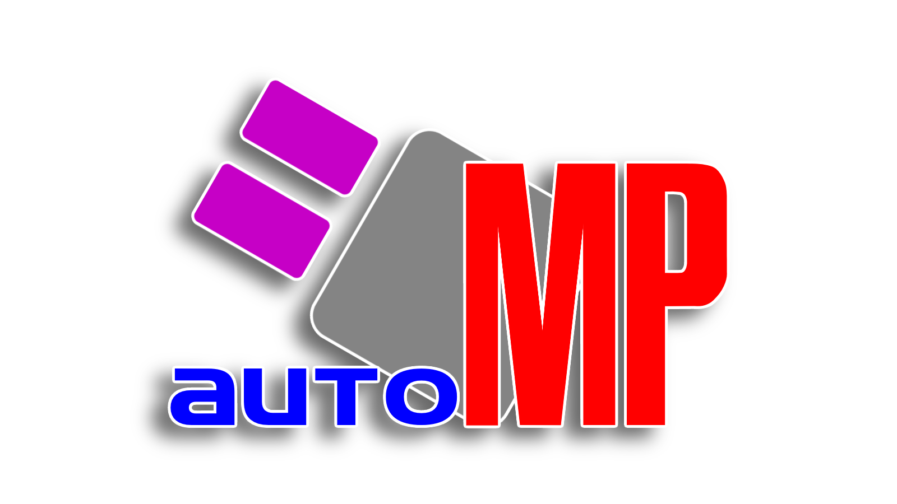

\
A tool for converting images into a Lua script for rendering in Mario Paint.

autoMP by marl

Based on Automatic Mario Paint by alden

Logo artwork, readme and extra help by G-Zone

Special thanks to greysondn

*This guide is written with accessibility in mind. My hope is that anyone will be able to use autoMP, even if you, like myself, are unfamiliar with things like Python and related software.  ~G-Zone*

**These instructions assume you are using Windows 10.**

## What you need

#### autoMP
Our image conversion and script writing utility. Be sure to download the latest version!\
-> https://github.com/marl64/autoMP/releases

#### Python
The interpreter for the Python programming language, which autoMP is built with. For best compatibility, use Python 3.6+.
* In the installer, be sure that "Add Python to PATH" is checked on the first page, then click Customize installation.
* For Optional Features, leave everything checked.
* For Advanced Options, be sure to check "Decompile standard library".\
-> https://www.python.org/downloads/

#### Pillow
A set of libraries for Python, required to run autoMP.
* After installing Python as instructed above, open Command Prompt (Press the Windows key, then type cmd), then right-click and press "Run as administrator".
* Type "pip install --upgrade Pillow" and press enter.

#### SNES9x with Lua support
This is a version of the SNES9x emulator which lets you run game-altering scripts. We have provided a configuration file that makes it slightly more convenient to draw images in Mario Paint. autoMP is not confirmed to work with any other emulators at this time.\
-> https://github.com/TASVideos/snes9x-rr/releases/tag/snes9x-151-v7.1

#### Lunar IPS
This is a very simple utility for patching ROM files.\
-> https://fusoya.eludevisibility.org/lips/

#### Mario Paint ROM file
Mario Paint is a 1992 art program for the Super Nintendo Entertainment System/Super Famicom that came bundled with the SNES Mouse.\
-> We can't provide a source for this file. You'll have to either dump an official cartridge yourself, or obtain it some other way. A quick web search should prove fruitful.

## Setup

1. Download and extract the autoMP files.

2. Open Lunar IPS. Click "Apply IPS Patch" and browse for the patch we provided, MarioPaintJUh1Joystick.ips, then for the Mario Paint ROM you want to patch it to. This modifies your ROM to accept the gamepad rather than the mouse for inputs, which allows our Lua scripts to control the game accurately. The Lua scripts WILL NOT WORK WITHOUT THIS PATCH.

3. Extract the SNES9x emulator into a seperate folder from autoMP. Place the provided snes9x.cfg file into your SNES9x folder (if there already is one, overwrite it), and make sure there are 2 sub-folders named "Roms" and "Saves". Place your patched ROM in the Roms folder and place the provided savestate, MarioPaint.000, in the Saves folder. **Make sure both your patched ROM and the savestate have the same filename. If they don't, rename one or both of them so that they match.**

4. If they don't already exist, create 2 new folders, "input" and "output" in the autoMP folder.

## Using autoMP

1. Place the image(s) you want to use into the input folder. Pretty much any image file should work. If one isn't accepted, try saving it as a common filetype, like .jpg or .png.

2. Open the file named autoMP_GUI and adjust the image settings to your liking. An explanation as to what each setting does is located below. When you're done, click "Process Images". This should fill the output folder with preview images, as well as lua scripts for each image in your input folder. For convenience when adjusting the image settings, you may open an image in an image viewer of your choosing and it should update whenever you have applied new settings and pressed the "Process Images" button.

3. Open SNES9x and load the ROM (Ctrl + O, or File > Open ROM...), then load the supplied savestate (Press the F1 key, or go to File > Load Game > Slot #0). You should now be on a blank canvas with the stamps page open at the top, with each stamp set to a single colored pixel.

4. Load your chosen Lua script into SNES9x (Press spacebar twice, or go to File > Lua Scripting > New Lua Scripting Window..., then choose your file from the output folder), then press Run and watch the image draw! *(Note: you can press the M key to toggle the sound.)* Do not close the scripting window or the drawing will stop. The drawing is complete once the game returns to normal speed. 

Voila! Your automatic work of art is finished!

From here, you can take screenshots (press the F12 key; screenshots are saved in the SNES9x Screenshots folder by default) or create a new savestate to keep your artwork (File > Save Game), but I don't recommend saving over Slot #0. You can also perform a hard save by clicking the robot head in the bottom center and pressing save. Remember, this modified ROM uses a controller instead of the mouse for inputs. By default, the arrow keys move your cursor and the D key selects, and you can hold the A or S keys to move your cursor faster. Once the robot is done saving your file (you can speed this up by holding Tab), it will create a .srm file in your Saves folder. This .srm is compatible with unmodified Mario Paint ROMs, and you can even load it onto a flash cart, or onto an original Mario Paint cartridge by using a Retrode, a RetroBlaster, or similar such devices. 

**We hope you enjoy making lots of Mario Paint masterpieces!**

## Image settings

The autoMP GUI gives you a bit of control over how autoMP processes your input images. Your settings are saved each time you change them, but you can always click "Default Settings" to wipe them clean. When I am adjusting image settings, I like to have the target image open in an image viewer so I can see how it changes each time I press "Process Images". I've found this to be the best way to dial in the exact look I'm going for.

**Note:**
Each time you run autoMP, it will apply the current list of settings to every image in the input folder, even images that have been processed already. This will overwrite the existing preview images and scripts in the output folder. You may want to store your images and scripts in a seperate folder to prevent them from being overwritten.

The available settings are as follows:

* Palette Select - Allows you to limit the colors your image uses.
  *  Default. Uses every color in the Mario Paint palette.
  *  Greyscale. Turns your image black and white.
  *  Your custom palettes - more info below!
* Scaling - Alters the image size to better fit it into the canvas space.
  * Original - Retains the shape of your image.
  * Zoom - Crops the edges of your image until it fills the canvas.
  * Stretch - Makes your image taller or wider until it fills the canvas.
* Dithering - Turn image dithering on or off.

**For the following 3 settings, you can insert any number you want, including single digit decimals. For example, if 1 is too dark and 2 is too bright, try 1.5 for better results. If 1 is too bright, try 0.8, etc. You cannot use negative numbers.**
* Contrast
* Brightness
* Saturation

**The following Preview Settings will only affect the preview images and will not change what the Lua scripts will draw.**
* Preview Scale - Enlarge the preview image output by a multiplier, with 1 being original size. Maximum 5.
* Preview Border - Add a border to the preview image.
  * 0 - No border.
  * 1 - Mario Paint canvas.
  * 2 - Mario Paint canvas set to the custom stamp screen-- what you'd see right after an autoMP image finished drawing.
  * 3 - Special autoMP border.
  * 4 and onward - Your custom preview borders - more info below!

### Custom palettes
To create your own custom palettes, open "config.txt". Being careful not to alter or erase anything else, scroll to the bottom of the document, where you will find the palette section. The palette "custom" is there as a template for you to fill out, and you can continue to make your own following the same template. You can name your palettes whatever you'd like, just be sure it's written inside a set of [brackets]. Below the palette name, type "colors = " followed by the colors you want to use, **seperated by commas but no spaces.**\
The available colors are as follows:\
\
**Type the color names exactly as listed here or they'll be skipped.**

Here's an example:

[Fire]

colors = red,orange,yellow

You can create as many custom palettes as you want, so please have fun experimenting with them!

### Custom preview borders
You can make your own borders to be applied to your preview images. Simply use the included template and draw in the white space outside the red outline. Be sure to save your border image in the "resources" folder with the other borders. Your border must be titled mpborder followed by a number. Note that mpborder1, mpborder2 and mpborder3 are already present, so your first custom border should be named mpborder4. To select that border in the GUI, simply set the "Preview Border" to 4. 

Like palettes, you can make as many preview image borders as you'd like! 

## Q&A

*Q: Why do I have to load that savestate?*

A: The stamps! Mario Paint's smallest brush size is 2x2. In order to work around this and paint with a single pixel brush, we need a custom stamp for each color in the palette which is, you guessed it, only a single pixel. To save you (and the bot) from having to make the stamps every time you want to print, you can simply load the savestate with all the stamps set up and the cursor in position, ready to draw. Plus, it saves you the trouble of catching Mario on the title screen!

*Q: What is the included snes9x.cfg file for?*

A: The .cfg or configuration file saves the emulator's settings. You can skip this step if you want, but I've disabled some obtrusive on-screen text, mapped the spacebar to open the Lua Script Window and the M key to toggle sound, and changed the default image size to 1x, which is easily resizable if you'd like. The inclusion of this .cfg is mostly for the convenience of the layman who may not be familiar with emulators.

*Q: I don't like how my image turned out. Can I prepare an image externally and have that turned into a Lua script?*

A: Yes! You just have to make sure your image is no larger than 248x168px and that it adheres to Mario Paint's color palette. Once you have it how you like, simply put it in the input folder and run autoMP as normal. Check your preview image in the output folder, and if done correctly, it should be identical to your input image.
